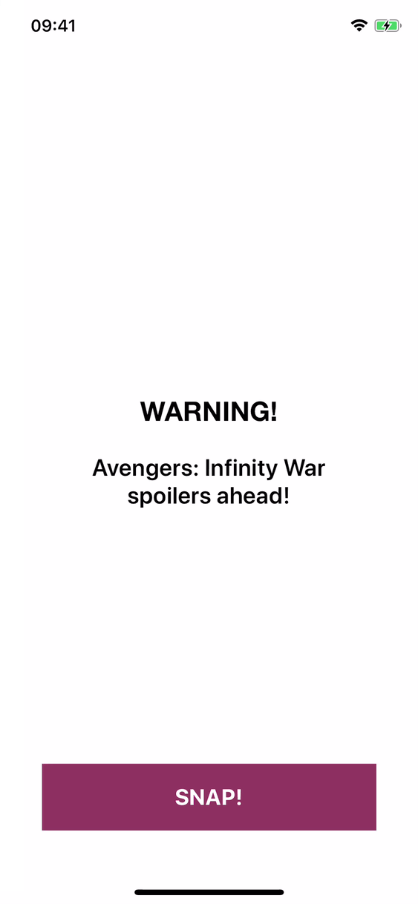

# Disintegrate

[](https://travis-ci.org/dbukowski/Disintegrate)
[](https://cocoapods.org/pods/Disintegrate)
[](https://github.com/Carthage/Carthage)
[](https://cocoapods.org/pods/Disintegrate)
[](https://cocoapods.org/pods/Disintegrate)
[](https://twitter.com/darekbukowski)

Disintegrate is a small library providing an animation inspired by how our favorite heroes disappeared at the end of Avengers: Infinity War.
The view or layer that you use it on is divided into small triangles, which then move into one direction and fade away. You can customize the estimated number of triangles and the direction they will move to.

<div align="center">
  <div>
  &nbsp;&nbsp;&nbsp;&nbsp;&nbsp;&nbsp;&nbsp;&nbsp;
  &nbsp;&nbsp;&nbsp;&nbsp;&nbsp;&nbsp;&nbsp;&nbsp;
  
  </div>
</div>
<br>

- [Usage](#usage)
- [Installation](#installation)
- [Example](#example)
- [Requirements](#requirements)
- [Author](#author)
- [License](#license)

## Usage

Disintegrate adds a single method to both UIView and CALayer classes.
```swift
func disintegrate(direction: DisintegrationDirection = DisintegrationDirection.random(),
                  estimatedTrianglesCount: Int = 66,
                  completion: (() -> ())? = nil)
```
The animation can be customized by two parameters:
* `direction` - direction in which the triangle particles will move. By default, the direction is chosen randomly from the set of 8 available options: up, down, left, right, upper left, upper right, lower left and lower right.
* `estimatedTrianglesCount` - estimated number of triangle particles. Specifying it allows you to adjust the performance of the animation to your needs. For example, if you know that you want to use it on a smaller view, you can divide it into more triangles. Keep in mind, that it is only an estimate, and the final count of the triangles will also depend on the exact size of the view or the layer. This parameter does have an empirically chosen default value, so you don't have to specify it.

Additionally, you can specify a completion block that will be executed when the animation finishes.

Here are some examples of using Disintegrate:
```swift
avatarImageView.disintegrate()
cancelButton.disintegrate(direction: .upperLeft)
gradientLayer.disintegrate(estimatedTrianglesCount: 100)
errorLabel.disintegrate(direction: .down, estimatedTrianglesCount: 200) {
    print("Error label animation finished.")
}
```

## Installation

### CocoaPods

Disintegrate is available through [CocoaPods](https://cocoapods.org). To install
it, simply add the following line to your Podfile:

```ruby
pod 'Disintegrate'
```

### Carthage

To integrate Disintegrate into your Xcode project using Carthage, specify it in your Cartfile:
```ruby
github "dbukowski/Disintegrate" ~> 0.2.0
```
Run carthage update to build the framework and drag the built Disintegrate.framework into your Xcode project.

### Manually

Alternatively, you can simply copy the 3 files from `Disintegrate/Classes` directory.


## Example

To run the example project, clone the repo, and run `pod install` from the Example directory first.

## Requirements

Disintegrate requires iOS 8.0 or later.

## Author

Dariusz Bukowski, dariusz.m.bukowski@gmail.com

## License

Disintegrate is available under the MIT license. See the LICENSE file for more info.
